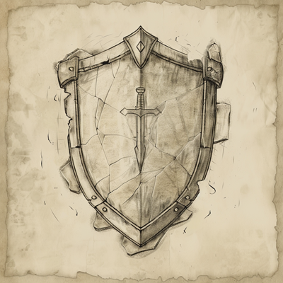

# Introdução
É crucial adotar uma abordagem abrangente e estruturada que garanta a segurança das aplicações web, por isso, este conteúdo
é apoiado por recursos como CERT, ISC, CVE, NVD, NIST, ISO, OWASP e práticas de Pentest, visando a criação de um ambiente 
robusto e resiliente. 

Aqui você encontrará experimentos e exemplos reais (divulgações) que levantam questões sobre a quebra ou não das diretrizes e 
melhores práticas.