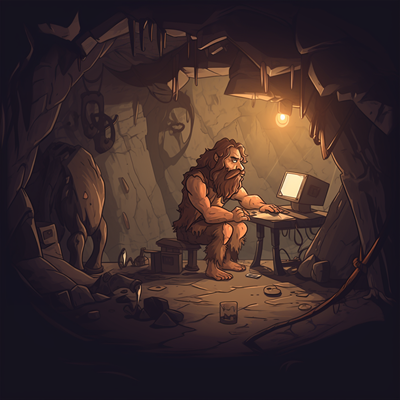

# Códice
Como Arquiteto de Soluções e Segurança, busco neste local compartilhar assuntos de meu interesse pessoal - _geralmente pouco ortodoxos_ -,
embora veja potencial de guiar futuros aspirantes ou curiosos da área. Disponibilizado nos tópicos abaixo, e publicado em capítulos
sem periodicidade regular - _filho pequeno..., sabem como é_ - , o Códice é um antro de informação que responde perguntas a qual
ninguém fez.

    Ægis
    
    
Testes de penetração, exploração de vulnerabilidades e outros assuntos sobre cibersegurança.

    Singularᴉdade
    
    
Orientado a devaneios cunhados a partir da observação do cotidiano analógico ou digital.

    Cachimônica
    
    
Tempestade cerebral sobre a concepção de uma linguagem de programação rupestre e interiorana.

    Apetrechos
    
    
Ferramentas consideravelmente boas que valem a pena conhecer e usar.

