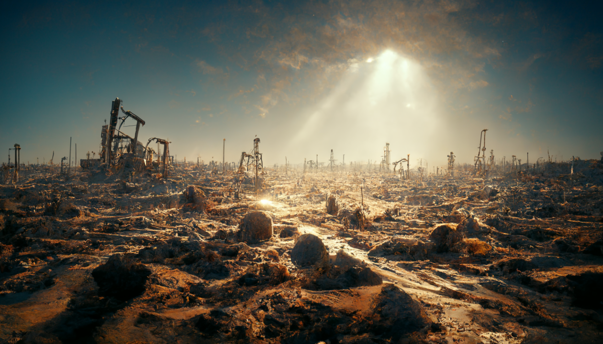
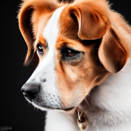
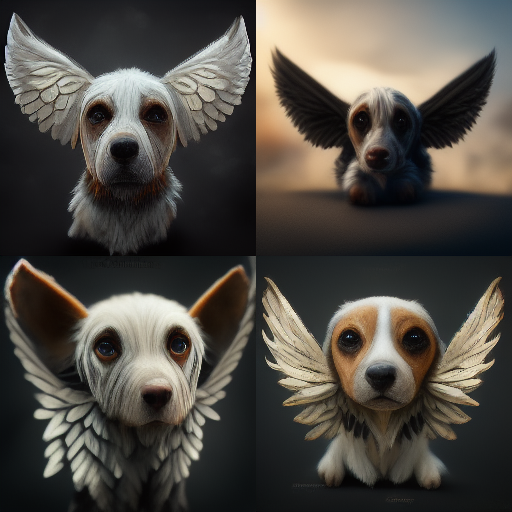
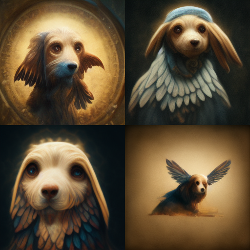

# I.A - (In)discutível Arte
Apesar do título sugestivo, não vou entrar na clássica discussão sobre "o que é arte". Esse é um debate tão subjetivo que 
poderia nos levar a um labirinto sem saída. Meu objetivo aqui é mais simples: quero contar a história de dois camaradas.

# Hotpot.AI
Meu primeiro contato com esse tipo de ferramenta foi com o simpático [Hotpot](https://hotpot.ai/). Ele oferece uma infinidade 
de aplicações, desde ideias textuais (_como sugestões de roteiros, livros, nomes para produtos, personagens, ideias gerais..._) 
até artes visuais (_edição de fotos, desenhos estilizados, NFTs..._). Cada ação solicitada consome uma quantidade de créditos 
proporcional à complexidade. Quase todas exigem créditos (_ou seja, são pagas_), mas há duas exceções gratuitas e interessantes. 
A primeira é o [Art Maker](https://hotpot.ai/art-maker?s=site-menu), que, como o nome sugere, faz... macarrão com queijo! 

Minto. Ele só cria arte a partir do que você digita:

>_"A dog with wings"_

Eu sei o que você está pensando: _"Nossa, que porcaria. Nada a ver."_ Mas, olha só, uma descrição meia boca vai te dar um resultado 
pé de chinelo. Então, é fundamental estruturar bem suas frases; caso contrário, sua interação com a ferramenta vai ser como 
tentar conversar com a velha surda. A segunda modalidade é o [AI Sparkwriter](https://hotpot.ai/sparkwriter?s=art-maker-text) (_art idea_), 
que promete ser a faísca criativa, gerando 5 frases sobre o assunto (_desde que você use pelo menos 5 palavras_). 

Vamos ver como funciona...

>_"a dog with **chicken** wings"_

Das `5` respostas que obtivemos, concentre-se na de número `2`:

1. With his giant wings, the dog eats the chicken and flies away.
2. **The dog is tired of people trying to pet him so he eats the chicken, gains wings and fly away**.
3. A close up of a chicken wing attached to a dog bone.
4. A hound with a full chicken wing for his meal.
5. The idea of eating chicken wings makes this dog too heavy, he jumps off his dining chair before it breaks.

Vamos ser honestos: a segunda opção tem seu valor. 

Convenhamos que você não teria pensado nessas ideias, teria? Nem mesmo
sob entorpecentes pesados! Ah, e vale mencionar que se você, por algum motivo, conseguir dar um nó na I.A, isto é, fazê-la pensar 
por mais de 2 horas sem gerar um resultado, o dono do site te dá 200 créditos para usar nos serviços pagos (_Oi, Clarence!_). 

Fiz meu pé de meia! =D

# Midjourney
Nessa minha segunda tentativa de transformar minhas ideias cataclísmicas e não ortodoxas em realidade, o [Midjourney](https://www.midjourney.com/home/)
se destacou com resultados surpreendentemente satisfatórios. Pelo [Discord](https://discord.com/), você pode bombardear a I.A. 
com requisições megalomaníacas. Mesmo que não saia exatamente como você imaginou, a arte final vai te agradar.

Vamos tentar de novo:

>_"A dog with wings"_

Em 1 minuto, ele te entrega 4 sugestões, que você pode variar ou recomeçar sem mudar a instrução principal (prompt). Quando 
estiver satisfeito, é só pedir a versão em alta definição. Simples assim. No site oficial, você encontra todas as _keywords_ para 
refinar os resultados, mas confesso que você aprende muito vendo a arte dos outros usuários. 

Quer um exemplo?

>_"A dog with wings, **da vinci**"_

Mas, claro, não existe almoço grátis: as primeiras 25 tentativas são gratuitas, depois disso, se tornam pagas (_vale cada centavo_). Não vou 
mostrar minhas super criações aqui porque são tão fantásticas que não quero que sejam usadas por terceiros. 

Então, fica a dica: vai lá tentar a sorte!

# E o Dall-E 2?
Infelizmente, por ser acessível apenas por convite, não tive a chance de bombardeá-lo com minhas frases mirabolantes. 
Mas a [capacidade dele é de cair o queixo](https://openai.com/blog/dall-e-introducing-outpainting/). Sendo assim, não posso opinar.

_Artigo originalmente postado em [11 de Setembro de 2022](https://www.linkedin.com/pulse/ia-indiscut%25C3%25ADvel-arte-raphael-moreira) | [LinkedIn](https://www.linkedin.com/newsletters/singular%25E1%25B4%2589dade-6974134289223307265/)_